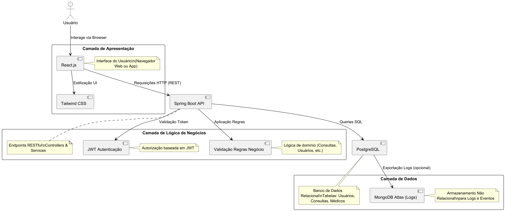
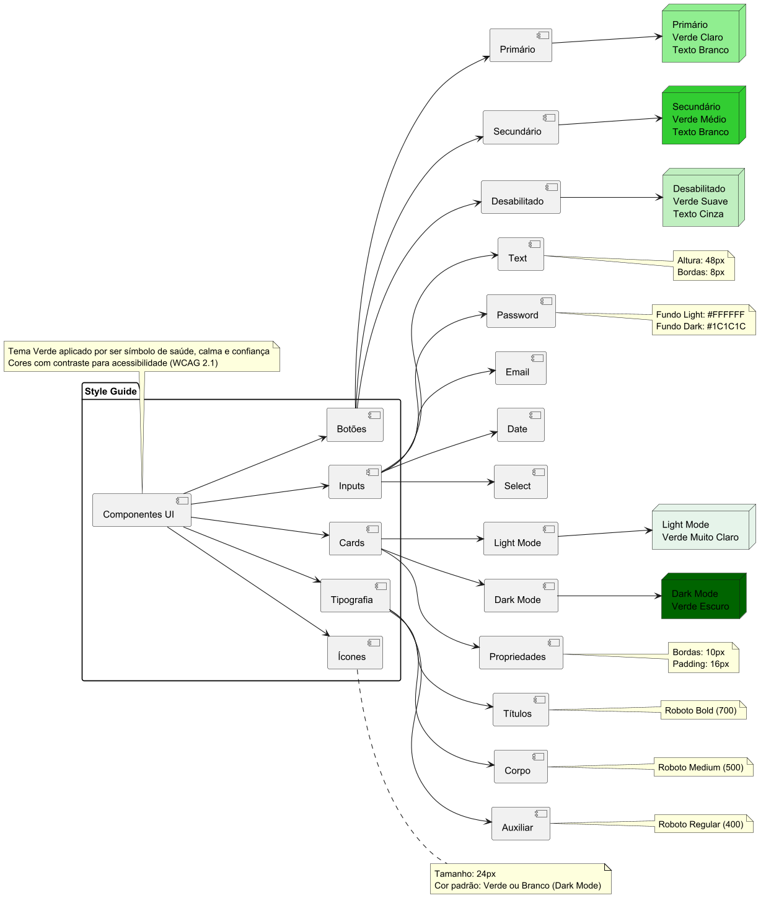
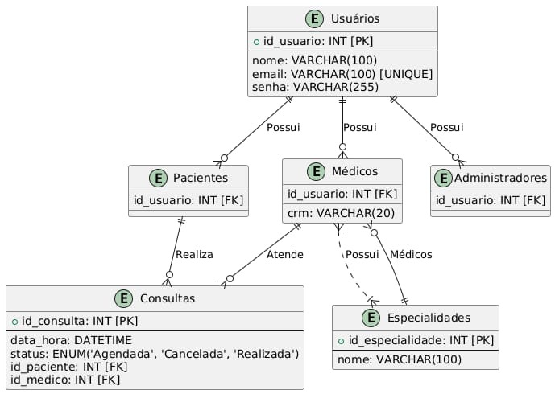
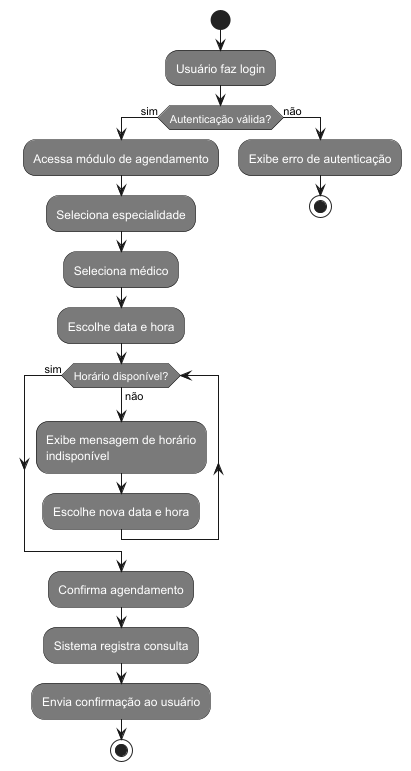

# Documentação do Projeto: Sistema de Gestão de Consultas Médicas - Vida+ Saúde

## Integrantes
- Davi Aguilar
- Pedro Moreira
- Rafael Chequer

Excelente solicitação! Vou expandir **os motivos das escolhas arquiteturais** e realizar uma **comparação mais detalhada** com outras opções, trazendo aspectos técnicos, prós e contras, e justificando a decisão de forma mais robusta.

Segue a versão aprimorada da seção:

---

## 🏗️ Arquitetura e Governança

### Estilo Arquitetural

O sistema adota a **Arquitetura em Camadas** utilizando **API RESTful** para comunicação entre o front-end e o back-end.

#### 📌 **Motivos da Escolha**

* **Simplicidade de desenvolvimento**: uma arquitetura monolítica permite que todas as partes do sistema sejam construídas e implantadas como uma única aplicação, facilitando o ciclo de vida inicial de desenvolvimento.
* **Facilidade de testes**: como as funcionalidades estão concentradas, testes end-to-end e de integração são mais diretos.
* **Baixa necessidade de escalabilidade granular**: o sistema da Vida+ Saúde não apresenta um volume inicial de acesso que demande escalabilidade independente de serviços, como microserviços exigiriam.
* **Integração direta entre módulos**: a ausência de dependências externas ou integrações complexas favorece a centralização em uma única base de código.
* **Custo operacional mais baixo**: a manutenção e hospedagem de um monólito são menos complexas e mais baratas comparadas a arquiteturas distribuídas.

👉 Em suma, **para um sistema de gestão de consultas médicas com escopo moderado e requisitos funcionais bem definidos, a arquitetura monolítica atende com eficiência sem sobrecarga desnecessária.**

---

### Comparação com Outras Arquiteturas

| Arquitetura                                  | Pontos Fortes                                                         | Pontos Fracos                                                                          | Motivo de Não Escolha                                         |
|----------------------------------------------| --------------------------------------------------------------------- | -------------------------------------------------------------------------------------- | ------------------------------------------------------------- |
| **Arquitetura em Camadas**                   | Simples, coeso, barato, fácil de implantar e testar                   | Escalabilidade limitada, dependências acopladas                                        | ✅ Escolhido: balanceia bem custo e requisitos                 |
| **Microserviços**                            | Escalabilidade granular, tolerância a falhas, deploy independente     | Complexidade elevada, sobrecarga de infraestrutura, necessidade de DevOps mais maduros | Não justifica a complexidade para um sistema de porte médio   |
| **Serverless / FaaS**                        | Sem necessidade de infraestrutura dedicada, escalabilidade automática | Latência em chamadas, custo imprevisível em alto uso                                   | Funcionalidades não são eventos independentes; não é adequado |
| **Event-Driven**                             | Ideal para sistemas com alta interação assíncrona                     | Complexidade de mensageria, difícil rastreabilidade                                    | O fluxo do sistema é síncrono e direto; desnecessário         |
| **Arquitetura Hexagonal (Ports & Adapters)** | Alto isolamento de lógica de negócios, foco em testes                 | Sobrecarga de abstração para sistemas pequenos/médios                                  | Abstração excessiva para o tamanho do projeto                 |

✅ **A escolha da arquitetura monolítica em camadas se justifica pelo equilíbrio entre complexidade, manutenção e custos operacionais, além de ser mais rápida para entregar valor no curto prazo.**

---

### Padrão em Camadas

O sistema é estruturado nas seguintes camadas:

1. **Apresentação**

    * Front-end em **React.js**, com **Tailwind CSS** para estilos rápidos e responsivos.
    * Responsável por renderizar interfaces e interagir via API REST com o back-end.

2. **Lógica de Negócios**

    * Implementada em **Java Spring Boot**, centraliza regras de negócio, validações e autenticação com **JWT (JSON Web Tokens)**.
    * Expondo endpoints RESTful para consumo pelo front-end.

3. **Dados**

    * Banco de dados **PostgreSQL** como repositório principal, garantindo integridade relacional e suporte ACID.
    * **MongoDB Atlas (opcional)** para logs ou armazenamento de dados semi-estruturados, sem impactar o core relacional.

---

#### 📌 **Motivos da Escolha do Padrão em Camadas**

* **Separação clara de responsabilidades**: cada camada tem um papel definido, facilitando manutenção e evolução.
* **Baixa curva de aprendizado**: os frameworks escolhidos (React.js, Spring Boot, PostgreSQL) são amplamente documentados e conhecidos pela equipe.
* **Escalabilidade modular (interna)**: ainda que monolítico, permite reorganizar ou otimizar partes da aplicação sem reescrever o todo.
* **Alinhamento com a stack atual do mercado**: garante maior empregabilidade futura do projeto e facilidade de contratação.

---

### Comparação com Outras Abordagens de Camadas/Design Patterns

| Abordagem                       | Pontos Fortes                               | Pontos Fracos                                               | Motivo de Não Escolha                                           |
| ------------------------------- | ------------------------------------------- | ----------------------------------------------------------- | --------------------------------------------------------------- |
| **3 Camadas (escolhida)**       | Simples, conhecida, rápida para implementar | Menor isolamento se comparado a arquiteturas mais abstratas | ✅ Melhor custo-benefício para o escopo                          |
| **Clean Architecture**          | Alta testabilidade, desacoplamento          | Curva de aprendizado mais longa, mais camadas de abstração  | Complexidade não necessária no momento                          |
| **MVC (Model-View-Controller)** | Útil para frameworks web completos          | Difícil separar lógica de negócios complexa                 | Spring Boot já impõe um padrão próximo a MVC                    |
| **CQRS + Event Sourcing**       | Excelente para leitura/escrita desacopladas | Complexidade de sincronização, necessidade de mensageria    | Sistema não exige alto volume de eventos ou queries divergentes |

✅ **A arquitetura em camadas clássica oferece o nível de separação necessário sem sobrecarga de abstrações.**

---

### Conclusão

A combinação de **Arquitetura Monolítica + Padrão em Camadas + API RESTful** foi escolhida porque:

✔ **Atende plenamente os requisitos funcionais atuais** (gestão de consultas, autenticação, CRUD de usuários e médicos).
✔ **Permite escalar progressivamente**, caso o sistema cresça no futuro, migrando gradualmente para microsserviços ou arquitetura hexagonal se necessário.
✔ **Oferece rapidez no time-to-market**: fundamental para validar o sistema com os usuários da Vida+ Saúde.
✔ **Minimiza custos de infraestrutura e DevOps**: ideal para ambientes com recursos moderados.

👉 **Caso o sistema passe a atender múltiplas clínicas ou hospitais, ou precise de integrações complexas com sistemas externos (ex: APIs de convênios), a migração para uma arquitetura baseada em serviços será mais viável. Por ora, o monólito entrega mais valor com menor complexidade.**

---
## 🔐 BackEnd
 ### Requisitos de Segurança
 - **OAuth2**: Autenticação e autorização segura para pacientes, médicos e administradores.
 - **HTTPS**: Garante a segurança na transmissão de dados sensíveis.
 - **JWT**: Tokens para autenticação de sessões e validação de permissões por tipo de usuário (Paciente, Médico, Administrador).
 - **Criptografia de Dados Sensíveis**: Senhas armazenadas com hash (ex.: bcrypt) e dados pessoais (como CPF) protegidos no banco.
 
 ### Protocolo de Comunicação
 - **API REST**: Comunicação entre front-end e back-end via HTTP, utilizando métodos padrão (GET, POST, PUT, DELETE) e respostas JSON.
 - **Formato de Dados**: JSON para troca de dados, com validação de esquemas via OpenAPI.
 
 ### Tecnologias Utilizadas
 - **Java com Spring Boot (versão 3.x)**: Framework principal para desenvolvimento do back-end, com suporte a API REST, injeção de dependências e validação.
 - **Spring Security**: Gerenciamento de autenticação e autorização.
 - **JPA/Hibernate**: Comunicação com o banco de dados relacional para persistência de dados.
 - **Lombok**: Redução de boilerplate no código Java.
 - **Maven**: Gerenciamento de dependências e build.
 
 ### Endpoints Principais (Baseado no OpenAPI fornecido)
 Os endpoints seguem a especificação OpenAPI 3.0.0 fornecida, com adições para suportar o sistema completo:
 
 1. **/cadastro/paciente** (POST)
    - **Descrição**: Cadastra um novo paciente.
    - **Parâmetros**:
      - `nome` (string, obrigatório): Nome completo do paciente.
      - `email` (string, obrigatório): E-mail único.
      - `senha` (string, obrigatório): Senha com validação de força.
      - `cpf` (string, obrigatório): CPF único.
    - **Respostas**:
      - `201`: Paciente cadastrado com sucesso.
      - `400`: Erro de validação (ex.: formato de e-mail inválido).
      - `409`: Conflito (e-mail ou CPF já cadastrado).
 
 2. **/cadastro/medico** (POST)
    - **Descrição**: Cadastra um novo médico.
    - **Parâmetros**:
      - `nome` (string, obrigatório): Nome completo do médico.
      - `email` (string, obrigatório): E-mail único.
      - `senha` (string, obrigatório): Senha com validação.
      - `cpf` (string, obrigatório): CPF único.
      - `crm` (string, obrigatório): CRM do médico.
      - `especialidade` (string, obrigatório): Especialidade médica.
    - **Respostas**:
      - `201`: Médico cadastrado com sucesso.
      - `400`: Erro de validação.
      - `409`: Conflito (e-mail, CPF ou CRM já cadastrado).
 
 3. **/login** (POST)
    - **Descrição**: Autentica um usuário (Paciente, Médico ou Administrador).
    - **Parâmetros**:
      - `identificador` (string, obrigatório): E-mail ou CPF.
      - `senha` (string, obrigatório): Senha do usuário.
    - **Respostas**:
      - `200`: Login bem-sucedido, retorna token JWT.
      - `401`: Credenciais inválidas.
      - `403`: Acesso negado para o tipo de usuário.
 
 4. **/consultas/agendamento** (POST)
    - **Descrição**: Agenda uma consulta para um paciente com um médico.
    - **Parâmetros**:
      - `pacienteId` (integer, obrigatório): ID do paciente.
      - `medicoId` (integer, obrigatório): ID do médico.
      - `data` (string, obrigatório): Data da consulta (formato ISO 8601).
      - `hora` (string, obrigatório): Hora da consulta.
    - **Respostas**:
      - `201`: Consulta agendada com sucesso.
      - `400`: Horário indisponível ou dados inválidos.
      - `403`: Permissão insuficiente.
 
 5. **/consultas/cancelamento/{id}** (DELETE)
    - **Descrição**: Cancela uma consulta com aviso prévio ao médico.
    - **Parâmetros**:
      - `id` (integer, path): ID da consulta.
    - **Respostas**:
      - `200`: Consulta cancelada com sucesso.
      - `404`: Consulta não encontrada.
      - `403`: Permissão insuficiente.
 
 6. **/relatorios/consultas** (GET)
    - **Descrição**: Gera relatórios de consultas por período.
    - **Parâmetros**:
      - `dataInicio` (string, query): Data inicial (ISO 8601).
      - `dataFim` (string, query): Data final (ISO 8601).
    - **Respostas**:
      - `200`: Relatório gerado com sucesso.
      - `400`: Parâmetros inválidos.

      ---

## 🎨 Style Guide

O sistema adota um **Design System** com tema principal em verde, representando saúde, calma e confiança.

#### Diagrama do Style Guide

*(O diagrama acima representa os principais componentes da interface, suas variações de cor e propriedades de estilo, incluindo botões, inputs, cards, tipografia e ícones.)*

A tabela abaixo complementa os detalhes das cores principais utilizadas:

### Light Mode
| Nome            | Código HEX | Uso Principal                     |
|----------------|------------|-----------------------------------|
| Primária        | #1E90FF    | Botões, links, bordas             |
| Secundária      | #32CD32    | Ações relacionadas à saúde        |
| Neutro Claro    | #F5F5F5    | Fundos de cards e telas           |
| Texto Principal | #000000    | Textos principais                 |
| Erro            | #FF0000    | Alertas e mensagens de erro       |
| Branco          | #FFFFFF    | Fundos principais                 |

### Dark Mode
| Nome            | Código HEX | Uso Principal                     |
|----------------|------------|-----------------------------------|
| Fundo Principal | #121212    | Fundo geral da tela               |
| Fundo de Cards  | #1C1C1C    | Fundos de cards e inputs          |
| Texto Principal | #FFFFFF    | Textos principais                 |
| Texto Secundário| #B0B0B0    | Textos auxiliares, placeholders   |
| Borda de Inputs | #333333    | Bordas de inputs e cards          |
| Primária        | #1E90FF    | Botões, links, bordas             |
| Erro            | #FF0000    | Alertas e mensagens de erro       |

---

## 🗄️ Banco de Dados

### SGBD Utilizado
- **PostgreSQL**: Banco relacional open-source, escolhido por sua robustez, suporte a SQL padrão e transações ACID.
- **MongoDB Atlas** (opcional): Para logs ou dados não estruturados, se necessário.

#### Diagrama Entidade-Relacionamento

*(O diagrama acima ilustra as tabelas principais e os relacionamentos entre usuários, consultas e especialidades.)*

---

## ⚙️ Fluxo de Funcionamento

O processo de agendamento de consultas segue um fluxo validado, garantindo consistência e disponibilidade de horários.

#### Fluxo de Agendamento

---

## 🎯 Motivação
O Sistema de Gestão de Consultas Médicas da Vida+ Saúde substitui processos manuais por uma solução digital eficiente, promovendo:
- **Escalabilidade**: Suporte a novas funcionalidades (ex.: notificações).
- **Usabilidade**: Interfaces acessíveis para todos os usuários.
- **Eficiência**: Automação de agendamentos e relatórios.
- **Segurança**: Proteção de dados com autenticação e criptografia.

A arquitetura em camadas e o Design System garantem uma experiência confiável, alinhada aos objetivos de modernização da Vida+ Saúde.
