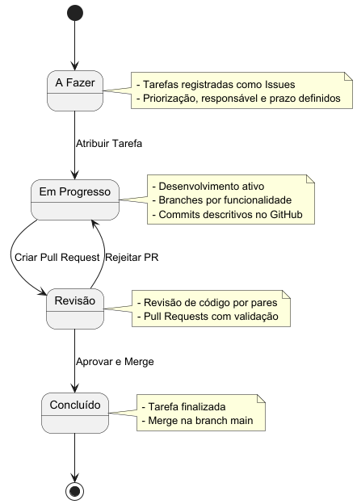

# Documentação do Projeto: Sistema de Gestão de Consultas Médicas - Vida+ Saúde

## Integrantes
- Davi Aguilar
- Pedro Moreira
- Rafael Chequer

## 🏗️ Arquitetura e Governança

### Estilo Arquitetural
O sistema adota a **Arquitetura em Camadas** com uma abordagem **monolítica**, utilizando **API RESTful** para comunicação entre front-end e back-end. Essa escolha é adequada para o sistema de gestão de consultas médicas da Vida+ Saúde, que possui funcionalidades bem definidas e não demanda integrações externas complexas. A arquitetura monolítica simplifica desenvolvimento, testes e implantação, enquanto o padrão em camadas garante modularidade e facilidade de manutenção.

### Padrão em Camadas
O sistema é organizado em três camadas:
1. **Apresentação**: Interface do usuário, desenvolvida com React.js e estilizada com Tailwind CSS.
2. **Lógica de Negócios**: Back-end implementado com Java Spring Boot, responsável por regras de negócio e processamento de requisições.
3. **Dados**: Banco de dados relacional PostgreSQL para persistência de dados estruturados.

Essa estrutura promove:
- **Separação de responsabilidades**: Cada camada tem funções específicas, reduzindo dependências.
- **Manutenibilidade**: Alterações em uma camada têm impacto mínimo nas demais.
- **Simplicidade**: Ideal para um projeto de porte médio com requisitos claros.

#### Diagrama de Arquitetura

### Governança do Projeto
A governança utiliza recursos do GitHub:
- **Commits**: Alterações documentadas com mensagens descritivas.
- **Pull Requests**: Revisão de código antes da integração.
- **Issues**: Registro de tarefas, bugs e melhorias.
- **Branches**: Desenvolvimento isolado de funcionalidades em branches separadas.

#### Fluxo de Governança

### Gestão de Tarefas
As tarefas são gerenciadas na aba **Projects** do GitHub, com um quadro **Kanban** dividido em:
- **A Fazer**: Tarefas pendentes.
- **Em Progresso**: Tarefas em andamento.
- **Concluído**: Tarefas finalizadas.

Cada tarefa é uma **issue** com responsável, prazo e descrição, garantindo:
- Planejamento claro.
- Priorização eficiente.
- Colaboração entre a equipe.

---

## 🎨 Style Guide

O sistema adota um **Design System** com tema principal em verde, representando saúde, calma e confiança.

#### Diagrama do Style Guide

*(O diagrama acima representa os principais componentes da interface, suas variações de cor e propriedades de estilo, incluindo botões, inputs, cards, tipografia e ícones.)*

A tabela abaixo complementa os detalhes das cores principais utilizadas:

### Light Mode
| Nome            | Código HEX | Uso Principal                     |
|----------------|------------|-----------------------------------|
| Primária        | #1E90FF    | Botões, links, bordas             |
| Secundária      | #32CD32    | Ações relacionadas à saúde        |
| Neutro Claro    | #F5F5F5    | Fundos de cards e telas           |
| Texto Principal | #000000    | Textos principais                 |
| Erro            | #FF0000    | Alertas e mensagens de erro       |
| Branco          | #FFFFFF    | Fundos principais                 |

### Dark Mode
| Nome            | Código HEX | Uso Principal                     |
|----------------|------------|-----------------------------------|
| Fundo Principal | #121212    | Fundo geral da tela               |
| Fundo de Cards  | #1C1C1C    | Fundos de cards e inputs          |
| Texto Principal | #FFFFFF    | Textos principais                 |
| Texto Secundário| #B0B0B0    | Textos auxiliares, placeholders   |
| Borda de Inputs | #333333    | Bordas de inputs e cards          |
| Primária        | #1E90FF    | Botões, links, bordas             |
| Erro            | #FF0000    | Alertas e mensagens de erro       |

---

## 🗄️ Banco de Dados

### SGBD Utilizado
- **PostgreSQL**: Banco relacional open-source, escolhido por sua robustez, suporte a SQL padrão e transações ACID.
- **MongoDB Atlas** (opcional): Para logs ou dados não estruturados, se necessário.

#### Diagrama Entidade-Relacionamento

*(O diagrama acima ilustra as tabelas principais e os relacionamentos entre usuários, consultas e especialidades.)*

---

## ⚙️ Fluxo de Funcionamento

O processo de agendamento de consultas segue um fluxo validado, garantindo consistência e disponibilidade de horários.

#### Fluxo de Agendamento

---

## 🎯 Motivação
O Sistema de Gestão de Consultas Médicas da Vida+ Saúde substitui processos manuais por uma solução digital eficiente, promovendo:
- **Escalabilidade**: Suporte a novas funcionalidades (ex.: notificações).
- **Usabilidade**: Interfaces acessíveis para todos os usuários.
- **Eficiência**: Automação de agendamentos e relatórios.
- **Segurança**: Proteção de dados com autenticação e criptografia.

A arquitetura em camadas e o Design System garantem uma experiência confiável, alinhada aos objetivos de modernização da Vida+ Saúde.